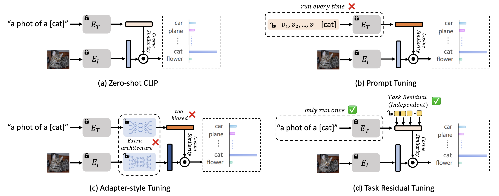

# Task Residual: Tuning Vision-Language Models in One Line of Code
The official implementation of [*Task Residual for Tuning Vision-Language Models*](https://arxiv.org/abs/2211.10277) (accepted to CVPR 2023).

The proposed Task Residual Tuning (TaskRes) is a new paradigm for tuning vision-language models (VLMs), which directly tunes the text-based classifier weights, without the need of heavy text encoders for prompt updates or carefully designed adapters.

## Comparison
- Prompt tuning tunes the input of the models;
- Adapters transform the pre-trained features by an MLP $\phi_{\omega}$: $\mathbf{f}'=\mathbf{f} + \alpha \phi_{\omega}(\mathbf{f})$ or $\mathbf{t}'=\mathbf{t} + \alpha \phi_{\omega}(\mathbf{t})$;
- TaskRes (Ours) directly tunes the text-based classifier weights in an *additive* way: $\mathbf{t}'=\mathbf{t}+\alpha\mathbf{x}$ where $\mathbf{x}$ is a set of learnable parameters.



## Installation
This repository requires to install the environment and datasets:
- follow [here](https://github.com/KaiyangZhou/Dassl.pytorch#installation) to install [Dassl.pytorch](https://github.com/KaiyangZhou/Dassl.pytorch) and PyTorch.
- run `pip install -r requirements.txt` under `TaskRes/` to install a few more packages required by [CLIP](https://github.com/openai/CLIP) (this should be done when `dassl` is activated).
- follow [DATASETS.md](DATASETS.md) to install the datasets.

*PS: You can also follow [CoOp](https://github.com/KaiyangZhou/CoOp) to perform the installation.*

## Usage
We present the basic usage here.

(a) Train regular TaskRes:
- see [train_regular.sh](train_regular.sh) to run regular TaskRes (i.e., using regular base).

(b) Train enhanced TaskRes:
- download [enhanced bases](https://drive.google.com/drive/folders/1_ehtvBRWbbcYZRTAcvtCyUTD_tL4GUiV?usp=share_link) and move the folder `strong_base` to `TaskRes/`.
- see [train_enhance.sh](train_enhance.sh) to run enhanced TaskRes (i.e., using enhanced base).

(c) Test domain generalization:
- see [test_dg.sh](test_dg.sh) to run enhanced TaskRes (i.e., using enhanced base).

*PS: Refer to [CoOp](https://github.com/KaiyangZhou/CoOp) for more usage.*

## Acknowledgment
This repository is mainly based on Kaiyang Zhou's repository [CoOp](https://github.com/KaiyangZhou/CoOp) code base. We sincerely thank Kaiyang for his awesome code base.

## Citation
If you find this work useful for your research, please cite us:
```
@inproceedings{yu2023task,
  title={Task Residual for Tuning Vision-Language Models},
  author={Yu, Tao and Lu, Zhihe and Jin, Xin and Chen, Zhibo and Wang, Xinchao},
  booktitle={Proceedings of the IEEE/CVF Conference on Computer Vision and Pattern Recognition},
  pages={10899--10909},
  year={2023}
}
```
